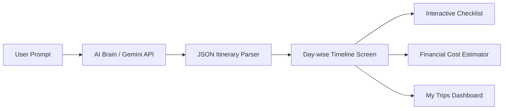

# 🌍 AI Trip Planner

> **Academic Project — Semester 5 Computer Engineering (SDP - Software Development Project)**  
> An intelligent mobile application built with **Flutter & Dart**, powered by **Google Gemini 2.5 Flash LLM**, that transforms free-form natural language travel prompts into detailed, structured, day-by-day travel itineraries.

---

## 📑 Table of Contents
1. [Project Overview & Problem Statement](#-project-overview--problem-statement)
2. [Key Features](#-key-features)
3. [Architecture & Technology Stack](#-architecture--technology-stack)
4. [Design System & Aesthetics](#-design-system--aesthetics)
5. [Application Screens & User Flow](#-application-screens--user-flow)
6. [API Testing for Professors & Evaluators (Postman)](#-api-testing-for-professors--evaluators-postman)
7. [Returned JSON Schema & Data Structure](#-returned-json-schema--data-structure)
8. [Database Schema (Current & SQLite Architecture)](#-database-schema)
9. [What to Implement Next (Phase 3 Roadmap)](#-what-to-implement-next-phase-3-roadmap)
10. [Setup & Running Instructions](#-setup--running-instructions)

---

## 📌 Project Overview & Problem Statement

### The Problem
Traditional travel planning is tedious and fragmented: users must manually search across flight search engines, train schedules, hotel sites, and tourist blogs to piece together an itinerary. 

### The Solution
The **AI Trip Planner** allows users to enter a simple, natural language sentence like:
> *"Plan a 3-day beach vacation to Goa via Train with water sports, beach shacks, and seafood."*

The application's AI engine automatically extracts the intent, destination, duration, transport preferences, and activities, transforming it into an interactive, cost-estimated, day-by-day timeline with live completion tracking.

---

## ✨ Key Features

1. **Natural Language Travel Parser**: Powered by Google Gemini 2.5 Flash API to extract destination, duration, transport mode, and itinerary highlights from unstructured text.
2. **Dual-Layer Architecture (Live AI + Local Fallback)**: If an API key is missing or network fails, a local heuristic intelligence engine seamlessly generates complete itineraries so the app never crashes or hangs.
3. **Interactive Day-by-Day Timeline**: Categorized activity cards (Transport, Hotel, Sightseeing, Dining, Leisure) with custom icons, time slots, and expense values.
4. **Financial Summary & Dynamic Cost Estimator**: Real-time aggregated budget calculation with collapsible category breakdowns (Hotels, Transport, Activities, Food) in Indian Rupees (INR ₹).
5. **Interactive Trip Progress Tracking**: Check off activities as they are completed with a live progress indicator.
6. **Departure Date Selector**: Custom calendar date picker with intelligent default scheduling.
7. **Curated Destination Explorer**: Showcase cards for popular destinations (Goa, Jaipur, Manali, Kerala, Paris, Tokyo, Rome, Swiss Alps) with 1-tap instant planning.
8. **Trip Lifecycle Management**: Filter between **Active**, **Upcoming**, and **Completed** trips with countdowns and progress badges.
9. **Dark & Light Mode**: Seamless theme switching with high-contrast, accessible palettes.

---

## 🛠 Architecture & Technology Stack

```text
lib/
├── main.dart                      # App entry point, multi-provider wiring, theme setup
├── core/                          # App-wide configurations
│   ├── config.dart                # Central API credentials and model configurations
│   ├── constants.dart             # App strings, layout dimensions, asset paths
│   ├── theme.dart                 # Apple-inspired light and dark themes
│   └── utils.dart                 # Currency (₹ INR), date formatting, and helpers
├── data/                          # Data & Service Layer
│   ├── local_db/
│   │   └── travel_catalog.dart    # Fallback catalog and offline destination spot database
│   ├── models/                    # Immutable data models with JSON serialization
│   │   ├── activity_model.dart    # Individual timeline events with category and cost
│   │   ├── destination_model.dart # Tourist destinations with curated spots
│   │   ├── trip_model.dart        # Complete trip entity containing multi-day activities
│   │   └── models.dart            # Export barrel file
│   └── services/
│       ├── ai_service.dart        # Gemini 2.5 Flash client with system prompt & JSON schema
│       └── travel_service.dart    # Travel data aggregation service
├── providers/                     # State Management (Provider pattern)
│   ├── auth_provider.dart         # Authentication state, mock user session, credentials
│   ├── trip_provider.dart         # Active trips, AI generation pipeline, filter states
│   └── ui_provider.dart           # Dark/Light theme mode state management
└── presentation/                  # UI Layer (Screens & Reusable Widgets)
    ├── screens/
    │   ├── auth_gate.dart         # Directs between Login and Main Dashboard
    │   ├── login_screen.dart      # Email/Password authentication
    │   ├── register_screen.dart   # New user registration
    │   ├── home_screen.dart       # Prompt input, quick ideas, departure date, destinations
    │   ├── itinerary_screen.dart  # Day-wise timeline, budget estimator, activity completion
    │   ├── destination_details_screen.dart # Destination deep-dive with 1-tap planner
    │   ├── my_trips_screen.dart   # Tabbed view of Active, Upcoming, and Completed journeys
    │   └── profile_screen.dart    # Theme toggle, API key configuration, data management
    └── widgets/
        ├── app_image.dart         # Resilient image loader (local assets + network fallback)
        ├── departure_date_selector.dart # Date picker with quick presets
        ├── spot_details_sheet.dart # Modal bottom sheet with spot highlights & pricing
        └── timeline_card.dart     # Timeline activity card with time badge and checkboxes
```

- **Framework**: Flutter 3.x (Dart 3.x)
- **State Management**: `provider` (MVVM Clean Architecture)
- **AI Brain**: Google Gemini 2.5 Flash (`google_generative_ai`)
- **Typography**: SF Pro / Inter font hierarchy
- **Styling**: Vanilla Flutter Custom Theme System (No Tailwind, strict custom tokens)

---

## 🎨 Design System & Aesthetics

The UI is modeled on an **Apple-inspired photography-first aesthetic**:
- **Palette**:
  - Primary Action Blue: `#0066CC` (Light) / `#2997FF` (Dark)
  - Success Green: `#34C759`
  - Canvas: `#FFFFFF` (Light) / `#1D1D1F` (Dark)
  - Surfaces: `#F5F5F7` (Parchment), `#2A2A2C` (Surface Tile)
- **Visual Polish**:
  - Zero cluttered chrome or gratuitous gradients.
  - Generous whitespace, refined micro-animations, and subtle hairline borders (`#E0E0E0`).
  - Strict typography scale with negative letter-spacing for headlines and high-contrast body text.

---

## 📱 Application Screens & User Flow



1. **Authentication**: Users can sign in or register with persistent session state.
2. **Home Dashboard**: Input travel plans freely, pick departure dates, or select quick idea chips (e.g. *Goa 3-Day Beach*, *Jaipur Royal Forts*, *Manali Snow Tour*).
3. **Itinerary Timeline**: Filter by "All Days" or specific days (Day 1, Day 2...), expand the Financial Summary to view category expenditures, and toggle activity completion.
4. **My Trips**: Review Active trips, upcoming travel plans, and completed journeys.

---

## 🔬 API Testing for Professors & Evaluators (Postman)

> [!IMPORTANT]
> **Why External Testing?**  
> In a professional consumer mobile app, raw JSON code and internal API debug logs must **not** be displayed to end users. To demonstrate the real Google Gemini API calls to academic examiners and professors, we provide a **self-contained Postman Collection**.

### Single Master Postman Collection
- **File Location**: `postman/Trip_Planner_Gemini_API.postman_collection.json`

### Step-by-Step Instructions to Show the Professor:

1. **Open Postman**: Launch the Postman application on your laptop.
2. **Import Collection**:
   - Click the **Import** button in Postman (top left).
   - Drag and drop or browse to `postman/Trip_Planner_Gemini_API.postman_collection.json`.
3. **Verify Built-in Variables**:
   - The collection comes pre-configured with the default Gemini API key and model (`gemini-2.5-flash`). No separate environment file is needed!
4. **Execute Requests**:
   - **Request 1: `1. Health Check - List Models`**
     - Click **Send**. Returns `200 OK` and lists all active Gemini models, proving the API key is active.
   - **Request 2: `2. Generate Itinerary - Goa Beach Trip (3 Days)`**
     - Click **Send**.
     - Shows the real POST request to `https://generativelanguage.googleapis.com/v1beta/models/gemini-2.5-flash:generateContent`.
     - Displays the structured JSON return with Day 1, Day 2, Day 3 activities, costs in INR (₹), and timings.
     - Automatically runs test assertions in the **Test Results** tab verifying `title`, `destination`, and `activities`.
   - **Request 3: `3. Generate Itinerary - Jaipur Heritage (3 Days)`**
     - Demonstrates cultural travel parsing.
   - **Request 4: `4. Generate Itinerary - Custom User Prompt`**
     - Modify the prompt text in the body and click **Send** to test any destination live in front of the professor.

---

## 📊 Returned JSON Schema & Data Structure

When the app or Postman queries Google Gemini, the LLM responds in strict JSON format matching this schema:

```json
{
  "title": "Goan Beach Bliss: 3-Day Coastal Escape",
  "destination": "Goa",
  "durationDays": 3,
  "transportMode": "Train",
  "keySpot": "Baga Beach",
  "activities": [
    {
      "dayNumber": 1,
      "activityType": "TRANSPORT",
      "title": "Train Arrival & Transfer to North Goa",
      "description": "Arrive at Madgaon or Thivim railway station and take a taxi to your hotel in North Goa.",
      "startHour": 10,
      "startMinute": 0,
      "endHour": 12,
      "endMinute": 0,
      "cost": 1500.0
    },
    {
      "dayNumber": 1,
      "activityType": "FOOD",
      "title": "Beach Shack Seafood Dinner",
      "description": "Indulge in fresh seafood at Baga beach shacks.",
      "startHour": 19,
      "startMinute": 30,
      "endHour": 21,
      "endMinute": 0,
      "cost": 1800.0
    }
  ]
}
```

---

## 🗄 Database Schema

### Current Architecture
Currently, state is managed dynamically in memory through `TripProvider`, with serialization support (`toMap()` and `fromMap()`) across all models:
- `TripModel`
- `ActivityModel`
- `DestinationModel`

### Proposed SQLite Schema (`sqflite`) for Phase 3:
```sql
CREATE TABLE trips (
    id TEXT PRIMARY KEY,
    title TEXT NOT NULL,
    destination TEXT NOT NULL,
    start_date TEXT NOT NULL,
    duration_days INTEGER NOT NULL,
    total_cost REAL NOT NULL,
    transport_mode TEXT,
    key_spot TEXT,
    is_live_ai INTEGER DEFAULT 0
);

CREATE TABLE activities (
    id TEXT PRIMARY KEY,
    trip_id TEXT NOT NULL,
    day_number INTEGER NOT NULL,
    activity_type TEXT NOT NULL,
    title TEXT NOT NULL,
    description TEXT,
    start_hour INTEGER,
    start_minute INTEGER,
    end_hour INTEGER,
    end_minute INTEGER,
    cost REAL DEFAULT 0.0,
    is_completed INTEGER DEFAULT 0,
    FOREIGN KEY (trip_id) REFERENCES trips (id) ON DELETE CASCADE
);
```

---

## 🚀 What to Implement Next (Phase 3 Roadmap)

To make this project stand out during your final semester evaluation and viva, here are the top 5 features to implement next, ordered by academic impact:

### 1. 💾 Persistent Local Database (SQLite via `sqflite`)
- **Goal**: Persist trips so that newly generated AI itineraries remain saved across app restarts and phone reboots.
- **Why it impresses professors**: Demonstrates relational database concepts (Foreign Keys, Cascade Delete, CRUD operations, transactions) on mobile.

### 2. 📄 Export Itinerary to PDF & WhatsApp Share
- **Goal**: Add an "Export Itinerary" button on the itinerary screen that generates a clean PDF travel document or formats a shareable text message.
- **Packages**: `pdf` and `printing` or `share_plus`.
- **Why it impresses professors**: Real-world practical utility that examiners love to test.

### 3. 🗺️ Map Route Visualization (Google Maps / OpenStreetMap)
- **Goal**: Add a map tab on the itinerary screen plotting numbered marker pins for Day 1, Day 2, and Day 3 spots with a route polyline connecting them.
- **Packages**: `flutter_map` (free OpenStreetMap) or `google_maps_flutter`.
- **Why it impresses professors**: Demonstrates GIS, coordinates, and spatial visualization.

### 4. ☀️ Real-Time Destination Weather Forecast
- **Goal**: When viewing an itinerary for Goa, Jaipur, or Manali, fetch and display a 3-day weather forecast (e.g. *29°C Sunny, Ideal for beach sports*).
- **API**: Free Open-Meteo API (requires no API key).
- **Why it impresses professors**: Demonstrates multi-API integration (Gemini LLM + Weather REST API).

### 5. 🧳 Smart AI Packing Checklist
- **Goal**: Automatically generate a tailored packing list based on the destination and season (e.g. Manali generates *thermal wear, trekking boots*; Goa generates *sunscreen, beachwear*).
- **Why it impresses professors**: Highlights end-to-end AI capabilities beyond simple text generation.

---

## 💻 Setup & Running Instructions

### Prerequisites
- Flutter SDK (version 3.16 or higher)
- Dart SDK (version 3.0 or higher)
- Android Studio / VS Code with Flutter Extension
- Postman (for external API demonstration)

### Installation
1. **Clone the repository**:
   ```bash
   git clone https://github.com/Frenil0393/Trip-Planner.git
   cd Trip-Planner
   ```

2. **Install dependencies**:
   ```bash
   flutter pub get
   ```

3. **Verify Code Quality & Run Tests**:
   ```bash
   flutter analyze
   flutter test
   ```
   *(All 25 unit and widget tests will pass)*

4. **Launch the App**:
   ```bash
   flutter run
   ```

5. **Run with Custom Gemini API Key (Optional)**:
   ```bash
   flutter run --dart-define=GEMINI_API_KEY=your_actual_gemini_api_key
   ```